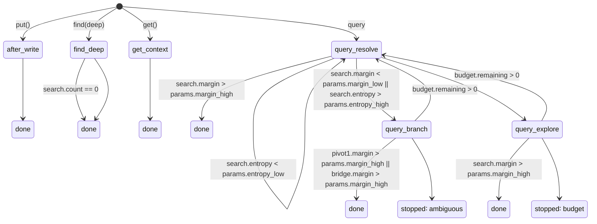

# Flows

## The problem with one-shot search

You've stored hundreds or thousands of notes — decisions, commitments, project context, meeting notes. Now you need to find something:

```bash
keep find "what authentication approach should we use?"
```

You get five results. Two are clearly relevant, one is noise, and two more *might* matter — but you can't tell without reading them. So you refine:

```bash
keep find "OAuth2 vs API keys security tradeoffs"
```

Better results. But now you've lost the first set. You open another search, read a related note, notice it links to a decision from last month, and chase that thread too.

This is what real research looks like. It's never one query. You start broad, look at what you found, realize what you actually need, and narrow down. Sometimes you branch sideways. Sometimes you need the system to do background work — summarize a long document, tag something for later, extract text from a PDF.

Flows make this normal workflow a first-class operation.

## How flows work

Every major operation in keep — `put`, `get`, `find` — runs through a **flow**. A flow is a sequence of steps driven by a **state doc** — a YAML document that says what to do, under what conditions, and what to do next.

Most flows are invisible. When you run `keep put "meeting notes"`, the runtime stores your note and then kicks off a background flow that summarizes it, tags it, and decomposes it into parts. When you run `keep get myproject`, the runtime assembles context — finding similar notes, resolved meta-docs, and structural parts — all driven by a state doc.

```
put("my note")           →  store  →  .state/after-write   (background)
get("myproject")         →  .state/get-context             (immediate)
find("auth", deep=True)  →  .state/find-deep               (immediate)
find("auth patterns")    →  .state/query-resolve            (immediate)
```

Each state doc defines **rules** that the runtime evaluates. Rules can run actions (search, summarize, tag), check conditions, and transition to other states. The runtime tracks what's been tried and stops when it finds a clear answer or exhausts its budget.

This matters for two reasons:

- **Processing is customizable.** State docs are editable documents in the store, not hardcoded logic. You can change how documents get processed after writes, build entirely new processing paths, and trigger them from updates, explicit API calls, or scheduled jobs.
- **Flows are collaborative.** A flow can run several steps, then return to the caller — human or agent — with partial results and a reason for stopping. The caller inspects what was found, decides what to do next, and directs the flow further. This works for query refinement, bulk retagging, document review, or any other memory-centric workflow where decisions belong to the caller, not the runtime.

## State transitions

Here's how the built-in flows connect:



There are two groups:

**Single-step flows** run one tick and return immediately. `after-write` fires all applicable processors in parallel. `get-context` assembles display context. `find-deep` searches then traverses edges from results. These never transition to other states.

**Multi-step query resolution** is where the state machine shines. `query-resolve` is the entry point: it searches, evaluates the results, and routes based on confidence signals. If the results are clear, it returns immediately. If they're ambiguous, it transitions to `query-branch` (parallel faceted search) or `query-explore` (wider search). Those states can loop back to `query-resolve` if budget remains, creating an iterative refinement loop that stops when results are good enough or budget is exhausted.

## What the runtime figures out for you

At each tick, the runtime looks at the results and computes a handful of practical signals:

- **Margin** — how much better is the top result than the second? High margin means a clear winner; low margin means ambiguity.
- **Entropy** — are results clustering around one topic or scattered across many? Low entropy means concentrated; high entropy means diverse.
- **Lineage** — are results mostly versions or parts of the same document? Strong lineage suggests narrowing to that document family.

From these signals, the state doc routes to one of several strategies:

| Situation | What happens |
|-----------|-------------|
| Clear winner (high margin) | Done — return the results |
| Strong lineage | Re-search constrained to that document family |
| Ambiguous (low margin, high entropy) | Branch — parallel searches with different tag filters |
| Concentrated but no winner | Narrow — re-search with top facet tags |
| Mixed signals | Explore — broaden the search and try again |

All thresholds come from config, not from the state docs themselves. You tune behavior by adjusting `margin_high`, `entropy_low`, etc. — the state docs define the structure, your config defines the policy.

## Background work

When you store a new item, keep automatically summarizes it, tags it, and decomposes it — all in the background. The `after-write` flow evaluates four rules in parallel:

- **Summarize** — if the content is long enough and no summary exists yet
- **OCR** — if the item has images needing text extraction
- **Analyze** — decompose non-system items into structural parts
- **Tag** — classify non-system items against tag specs (`.tag/*`) in the store

What runs is determined by the state doc (`.state/after-write`), not by caller flags. Users customize processing by editing the state doc.

If the same item is updated rapidly, keep uses **supersede-on-enqueue**: newer work automatically marks older unclaimed work for the same item as superseded, so only the latest version gets processed.

## State docs

The processing logic for every flow lives in a **state doc** — a keep note with an ID like `.state/query-resolve` that contains YAML rules.

```yaml
# Entry point for multi-step query resolution.
match: sequence
rules:
  - id: search
    do: find
    with:
      query: "{params.query}"
      limit: "{params.limit}"
  - when: "search.margin > params.margin_high"
    return: done
  - when: "search.entropy > params.entropy_high"
    then: query-branch
  - then: query-explore
```

Rules have up to four parts: a **condition** (`when:`), an **action** (`do:`), a **transition** (`then:`), or a **terminal** (`return:`). The runtime evaluates them according to the `match:` mode:

- `match: sequence` — rules evaluate top-to-bottom, first matching rule wins
- `match: all` — all rules with satisfied conditions fire in parallel

State docs ship as system defaults but are fully editable. Fork one to customize how your queries resolve, what processing runs after a put, or how context is assembled for display. Use `keep config --reset-system-docs` to restore defaults.

## Three outcomes

Every flow ends in one of three states:

| Status | Meaning | What to do |
|--------|---------|------------|
| `done` | Complete | Read the results |
| `error` | Failed | Inspect and retry or abandon |
| `stopped` | Paused/exhausted | Accept partial results or retry with more budget |

`stopped` covers several situations: budget exhausted, ambiguous results needing guidance, or background work dispatched. The response includes a `reason` field explaining why.

## Compatibility

The existing `keep get`, `keep find`, and `keep put` commands work exactly as before. Flows run behind them — a simple `find` with a clear result resolves in one tick with zero overhead. The flow machinery is invisible unless results are ambiguous or background processing is needed.

## Diagnostics

- `keep doctor --log` — tail the ops log to watch flow transitions in real time
- `keep config --state-diagram` — generate a Mermaid state-transition diagram from current state docs
- `keep doctor` — validates all system docs (including state docs) as part of its checks

## See also

- [FLOW_STATE_DOCS.md](FLOW_STATE_DOCS.md) — Built-in state doc reference
- [API-SCHEMA.md](API-SCHEMA.md) — General keep API reference
- [AGENT-GUIDE.md](AGENT-GUIDE.md) — Working session patterns
- [KEEP-MCP.md](KEEP-MCP.md) — MCP server setup
- [docs/design/](design/) — State doc schema, actions, and design docs
