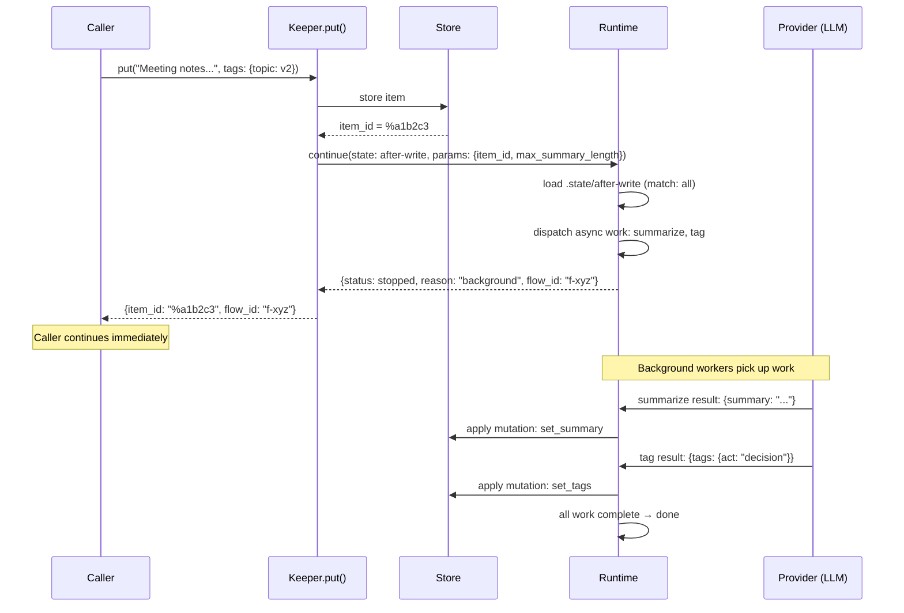
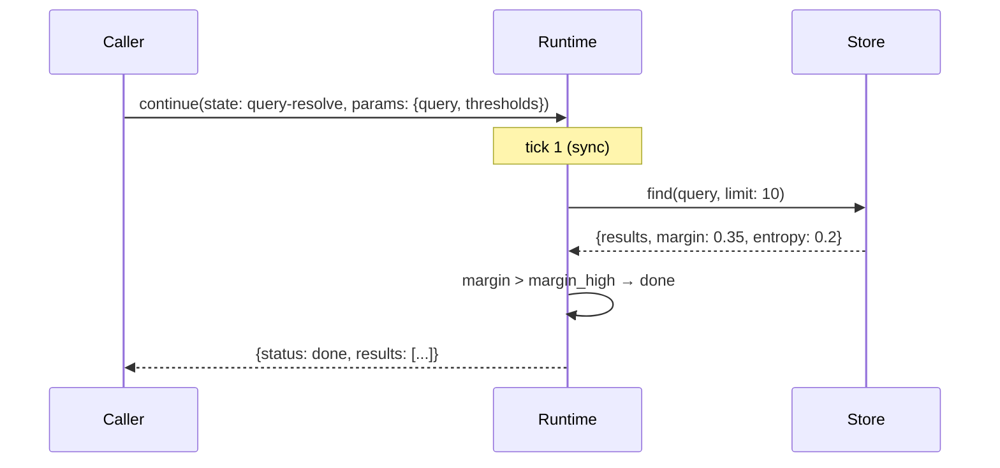
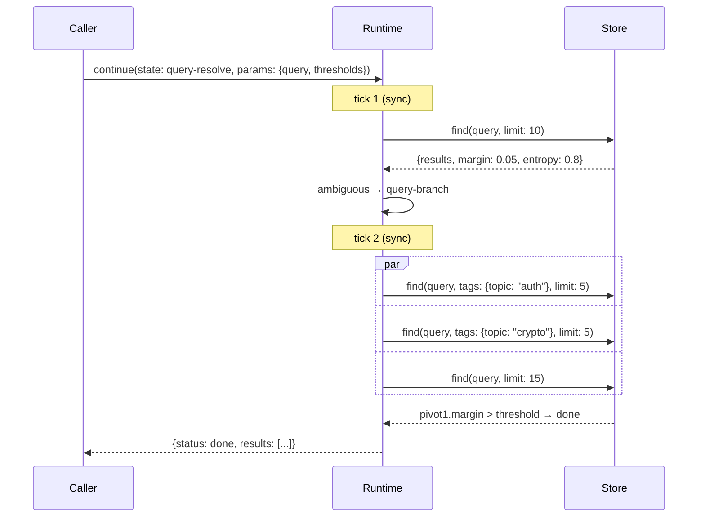
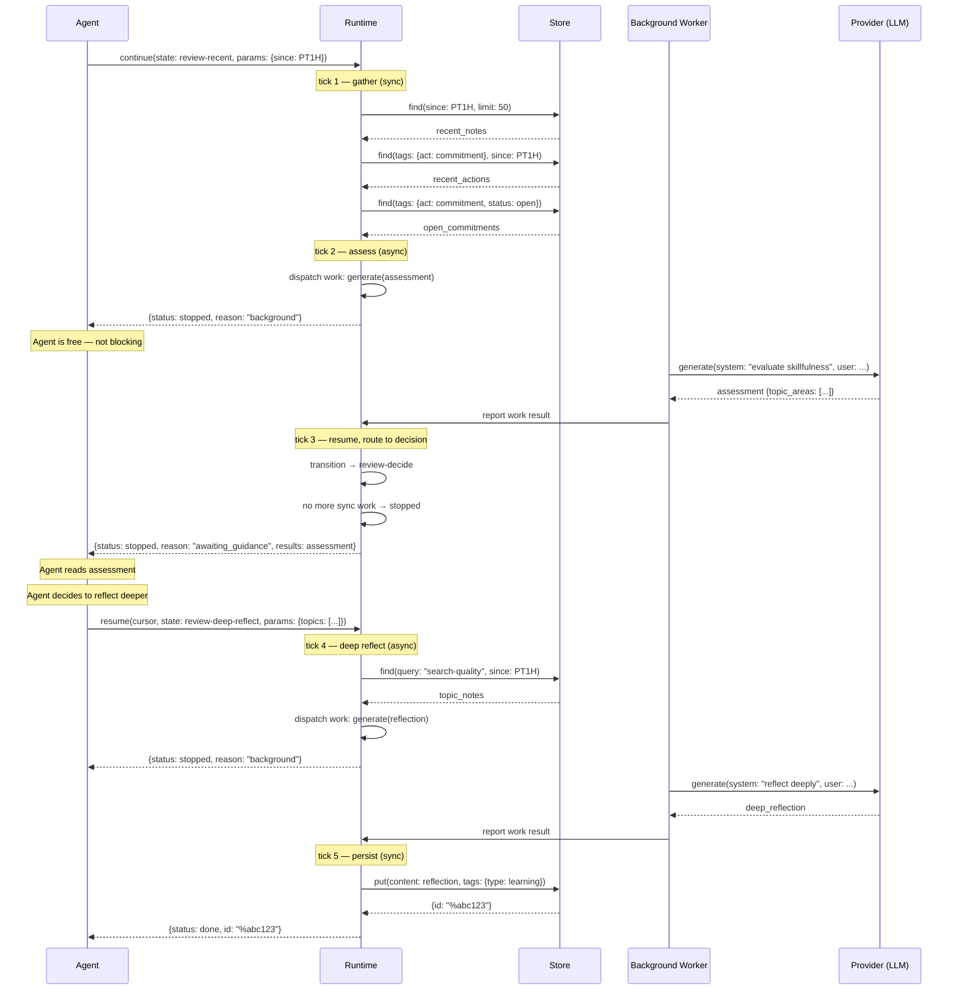

# State Doc Interaction Patterns

Date: 2026-03-07
Status: Draft
Related:
- `docs/design/STATE-DOC-SCHEMA.md`
- `docs/design/STATE-DOC-EXAMPLES.md`

## 1) The question

How do results surface to the caller (person or agent)?
When does the caller see anything? When does the caller act?
What is the relationship between the flow and decision-making?

Actions are either **sync** (store queries — milliseconds) or
**async** (provider calls — seconds). Async actions dispatch
immediately and the flow continues. Sync and async mix freely;
the flow waits for results only when it needs them.

## 2) Write path: immediate return, background processing

The caller gets their item ID back immediately. Processing
(summarize, tag, OCR) happens in the background. The `flow_id`
provides traceability — the caller can inspect the execution
trace at any later point.



**What the caller sees**: the item ID and a flow ID. The caller
can ignore the flow ID (fire-and-forget) or use it later:

```python
result = keeper.put("Meeting notes...")
# result.item_id = "%a1b2c3"
# result.flow_id = "f-xyz"

# Later — inspect what happened:
flow = store.get_flow(result.flow_id)
# flow.status → "done"
# flow.state → full trace: mutations applied,
#   summary generated, tags assigned, work results
```

The continuation store (`continuation_store.py`) already records
every mutation, every work result, every state transition. The
`flow_id` is the existing handle to all of it. Nothing new needed.

The item itself also shows the results — `get` it later and it
has its summary, tags, etc. The flow trace is for when you want
to know *how* and *when* those were produced.

## 3) Query path: synchronous, caller blocks

Store queries are fast. The caller blocks while the runtime
searches, evaluates, and potentially re-searches.



One tick. All synchronous. No mutations, no async work — so
**no flow is persisted**. The runtime evaluates rules in memory
and returns the result. Zero writes to the flow database. This
must be indistinguishable in cost from calling `find()` directly.

Flow persistence is only needed when:
- Async work is dispatched (flow must survive between dispatch and result)
- Mutations are applied (trace has value)
- `stopped` suspends (flow must survive between suspension and resume)

### Multi-tick query (still synchronous)



Two ticks, but still synchronous. Every action is a store query.
The caller blocks for maybe 50ms total. This is transparent —
the caller doesn't know it took multiple searches.

## 4) Mixing sync and async

Store queries are sync (milliseconds). Provider calls are async
(seconds). **Async actions dispatch immediately** — the flow
continues evaluating subsequent rules without blocking.

| Action | Sync/Async | Why |
|--------|-----------|-----|
| `find` | sync | Store query |
| `get` | sync | Store lookup |
| `put` | sync | Store write |
| `summarize` | async | LLM provider call |
| `tag` | async | LLM provider call |
| `ocr` | async | OCR provider call |
| `analyze` | async | LLM provider call |
| `generate` | async | LLM provider call |

`match: all` handles this naturally: dispatch summarize (async)
and tag (async), both run concurrently, `post:` runs when all
complete. In `match: sequence`, the flow waits for each action's
result before evaluating the next rule (since the next rule may
reference the output by `id`). The flow returns `stopped` (reason:
`"background"`) when it has dispatched async work and has nothing
left to do synchronously.

### Reflection flow: sync and async mixed



### What the agent sees, in order:

1. **`stopped`** (reason: `"background"`) — async work dispatched,
   nothing left to do synchronously. Agent is free.
2. **`stopped`** (on check) — still processing (the LLM assessment
   hasn't completed yet).
3. **`stopped`** (reason: `"awaiting_guidance"`) — the assessment
   is ready, results attached. This is the first time the agent
   sees content.
4. **`stopped`** (reason: `"background"`) — the deep reflection is
   being generated.
5. **`done`** — the learning was persisted.

The agent's interaction is: start → poll/wait → receive results +
decide next step → poll/wait → receive result. Every non-terminal
response is `stopped` — the reason tells the agent why.

## 5) The three caller experiences

```
┌─────────────────────────────────────────────────────────┐
│  Fire-and-forget (write path)                           │
│                                                         │
│  Caller: put("content") → gets ID immediately           │
│  Flow: runs entirely in background                      │
│  Caller never polls, never waits                        │
│  Item gains summary/tags asynchronously                 │
└─────────────────────────────────────────────────────────┘

┌─────────────────────────────────────────────────────────┐
│  Synchronous resolve (query path)                       │
│                                                         │
│  Caller: find("query") → blocks → gets results          │
│  Flow: all store queries, runs in ~50ms                 │
│  Caller sees one response: done + results               │
│  Indistinguishable from a direct find() call            │
└─────────────────────────────────────────────────────────┘

┌─────────────────────────────────────────────────────────┐
│  Interactive (scheduled/agent flows)                    │
│                                                         │
│  Caller: continue() → stopped → resume → done           │
│  Flow: mixes sync queries + async LLM calls             │
│  Caller polls for status between async steps            │
│  Caller steers with state/params on resume              │
│  Multiple round-trips possible                          │
└─────────────────────────────────────────────────────────┘
```

## 6) Where does decisionmaking live?

The diagrams reveal three layers:

```
┌──────────────────────────────────────────────┐
│  Policy (caller)                             │
│  - thresholds, budgets, preferences          │
│  - "what counts as good enough"              │
│  - injected via params.*                     │
└──────────────┬───────────────────────────────┘
               │
┌──────────────▼───────────────────────────────┐
│  Structure (state doc)                       │
│  - what to do, in what order                 │
│  - when to search, when to stop              │
│  - when to ask the caller                    │
│  - expressed as rules                        │
└──────────────┬───────────────────────────────┘
               │
┌──────────────▼───────────────────────────────┐
│  Judgment (caller, at stopped)               │
│  - substantive choices                       │
│  - "I want this one" / "dig deeper here"     │
│  - requires understanding the context        │
└──────────────────────────────────────────────┘
```

**Policy** is pre-set. The caller says "margin_high is 0.18" before
the flow starts. Policy doesn't require interaction during the flow.

**Structure** is the state doc. It decides the sequence of actions,
the routing logic, when to transition. Editable but stable — changes
between flows, not during them.

**Judgment** happens when the flow returns `stopped`. The caller
receives partial results and context, then decides how to proceed —
resume to a new state, adjust params, or accept what's there.
Everything else is automated.

The design question for any flow: **which decisions are Policy
(settable in advance), which are Structure (expressible as rules),
and which require Judgment (interactive)?**

## 7) What the caller sees: the surface contract

Every `continue()` call returns a status and a `flow_id`.
The `flow_id` is the handle to the full execution trace —
mutations, work results, state transitions — stored in
`continuation_store`. It's always present, even for one-tick
flows.

```python
# Resolved
{"status": "done", "flow_id": "...", "results": [...]}

# Paused — flow cannot proceed without caller
{"status": "stopped", "flow_id": "...", "cursor": "...", "reason": "...", "results": {...}}

# Failed
{"status": "error", "flow_id": "...", "error": "..."}
```

The `reason` field on `stopped` tells the caller why the flow paused:

| Reason | Meaning |
|--------|---------|
| `"background"` | Async work dispatched, nothing left to do synchronously |
| `"budget"` | Tick budget exhausted |
| `"ambiguous"` | Multiple candidates, no clear winner |
| (other) | State doc can set any reason string |

The caller's code:

```python
result = continue(input)

while result.status == "stopped":
    if result.reason == "background":
        # poll, or wait for notification
        result = continue({"cursor": result.cursor})
    else:
        # caller decides what to do next
        result = continue({
            "cursor": result.cursor,
            "state": next_state,       # optional: redirect
            "params": extra_params,    # optional: adjust
            "budget": {"ticks": 5},    # optional: extend
        })

if result.status == "done":
    use(result)
elif result.status == "error":
    handle(result.error)
```

Three statuses, one resume pattern. This is the entire
caller-side contract.

## 8) Open questions

- [ ] Should `stopped` with reason `"background"` support push
      notifications (webhooks, SSE) instead of requiring polling?
- [ ] Audit trail: can the caller inspect what happened after?
