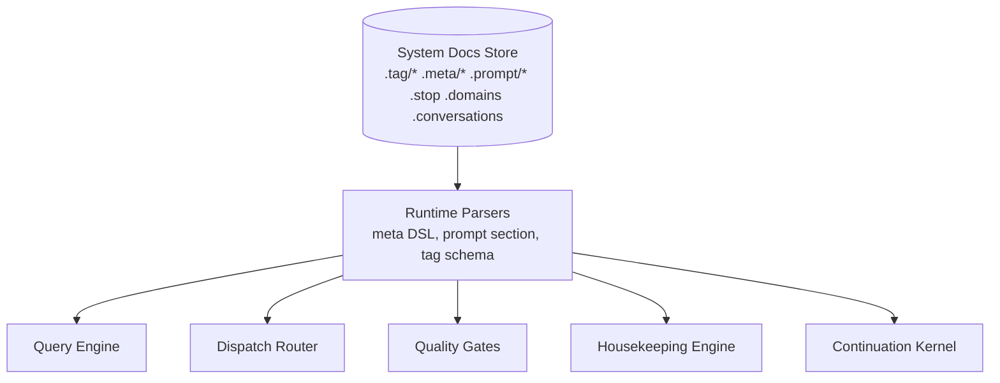

# Continuation Machine: Implementation Block Diagram

Date: 2026-03-03
Related:
- `later/continuation-api-spec.md`

## Architectural Block Diagram

```mermaid
flowchart LR
    U[Client / MCP Tooling] -->|continue(input)| F[Continuation Facade]
    F --> S[(Flow Store<br/>state + work graph + cursors)]
    F --> K[Continuation Kernel]

    subgraph KERNEL[Continuation Kernel]
      P[Projection Planner<br/>seed + pipeline + budget]
      R[Runtime Scheduler<br/>pressure/utility loop]
      D[Dispatch Router<br/>rule-first executor select]
      G[Quality Gates + Escalation]
      H[Housekeeping Engine<br/>auto tag/link ops]
      C[Commit Planner<br/>intentional writes]
      X[Projection Renderer<br/>task/evidence/hygiene views]
    end

    K --> Q[Query Engine]
    Q --> N[(Node+Fact Store)]
    Q --> V[(Vector Index)]
    Q --> T[(FTS Index)]

    D --> E1[Specialized Machine Adapter<br/>summarize/extract/theme]
    D --> E2[Sub-Agent Adapter<br/>thread scan/probe]
    D --> E3[Primary Agent Adapter<br/>disambiguate/synthesize/decide]

    E1 --> NORM[Result Normalizer]
    E2 --> NORM
    E3 --> NORM
    NORM --> G
    G -->|accept/revise/escalate| R

    H --> M[Mutation Engine]
    C --> M
    M --> N
    M --> V
    M --> T

    R --> X
    X --> F
    F -->|continue(output)| U

    F --> O[(Event Log / Observability)]
    K --> O
    M --> O
```

## Metaschema Plane (Control-By-Document)



In this design, metaschema is not a side file; it is a first-class data plane that runtime modules read each tick.

## How This Becomes "The Machine"

1. Single API boundary: `continue(input) -> output`.
2. Facade loads flow state and hands control to kernel.
3. Kernel runs one control tick:
   - compute frame over memory
   - auto-apply safe housekeeping
   - spawn/rank work
   - dispatch by executor rules
   - gate results and escalate when needed
4. Kernel returns:
   - frame views for user/agent
   - work requests
   - updated state cursor/frontier/budget
5. Facade persists state and emits normalized output.

## Frame vs State

- `Frame`: derived per tick from memory + state (`slots` + `views`).
- `State`: durable flow progress (`cursor`, `frontier`, `status`, unresolved requests).

Persistence rule:
- persist `State` and emitted work atomically every tick.
- persist `Frame` only as optional cache (safe to recompute after crash/restart).

## Execution Boundaries (Canonical)

Keep the current split:
- Foreground API path stays low-latency (`put/get/find/continue` control ticks).
- Background processing path handles heavy transforms (OCR, summarize, analyze, reindex/embed).

Use three deployment profiles with explicit ownership:

| Profile | Foreground owner | Background owner | Queue owner |
|---|---|---|---|
| `local_only` | local `Keeper` | local `keep pending --daemon` | local `pending_summaries` |
| `hybrid_delegate` | local `Keeper` | local daemon + hosted task executors for delegatable kinds | local `pending_summaries` (source of truth) |
| `remote_only` | `RemoteKeeper` -> hosted API | hosted worker containers | hosted queue/work graph |

Rules:
1. In `local_only` and `hybrid_delegate`, keep `pending_summaries` and daemon loop as-is.
2. In `hybrid_delegate`, delegation happens only at task level inside `process_pending` for delegatable profile steps, with stale fallback back to local processing.
3. In `remote_only`, delegation happens at API boundary (CLI/MCP -> hosted API). Local daemon/queue is not authoritative.
4. Never allow dual queue ownership for the same flow/task lineage.

Hosted-service mapping:
- Current hosted daemon replacement (queue-driven container workers) remains valid.
- Remote interfaces should delegate at API boundary; hosted service then performs internal scheduling/queue selection.
- Local hybrid path continues to delegate through the task API for specific work items only.

This preserves current operational behavior while allowing continuation `work` contracts to map onto either:
- local pending queue records, or
- hosted queue/work graph records.

## Concrete Module Cut (Single-Process First)

- `api.continue`: facade + request/response validation
- `runtime.flow_store`: flow state + work graph persistence
- `runtime.kernel`: scheduler loop, frontier updates, stop tests
- `runtime.dispatch`: executor registry + routing rules
- `runtime.gates`: confidence/citation/conflict gates
- `runtime.housekeeping`: lightweight tagging/linking operations
- `runtime.commit`: intentional write planning and transaction apply
- `query.engine`: push-down execution for phase-1 operators (`where|slice`)
- `adapters.*`: specialized machine, sub-agent, and primary-agent connectors
- `telemetry.events`: event log, traces, metrics

Start as a monolith process with these module boundaries; split into services only when throughput or isolation demands it.

## What Is Meta-Encoded vs Hard-Coded

Meta-encoded in system documents (mutable by advanced users):
- Tag schema semantics:
  - constrained keys and valid values (`.tag/KEY`, `.tag/KEY/VALUE`)
  - edge declarations via `_inverse` on `.tag/KEY`
  - classifier guidance via `## Prompt` in tag docs
- Contextual surfacing policy:
  - `.meta/*` query/context/prerequisite rules for what appears in `meta/*` sections
- Prompting policy:
  - `.prompt/summarize/*` and `.prompt/analyze/*` match rules + prompt text
  - `.prompt/agent/*` templates for agent workflow scaffolds
- Session practice docs:
  - `.stop`, `.domains`, `.conversations`, `.now` reference material

Hard-coded in runtime (stable kernel mechanics):
- Continuation lifecycle:
  - flow state persistence, cursor/frontier/budget mechanics
- Scheduler mechanics:
  - runnable set, utility/pressure scoring loop, stop conditions
- Dispatch mechanics:
  - executor capability filtering, fallback/escalation control flow
- Safety and integrity:
  - transactional mutation, audit/event logging, permissions boundaries
- Core retrieval primitives:
  - low-level execution of supported frame operators

Design rule: metaschema declares *what policy means*; kernel code defines *how policy is executed safely and repeatably*.

Hosted authorization details are out of scope for this local-first architecture document.
