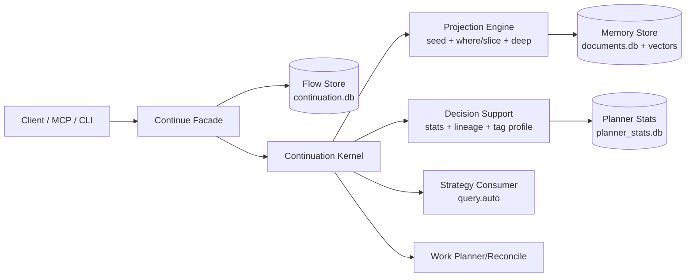

# Continuation Machine Architecture

Date: 2026-03-05
Status: Canonical
Related:
- `later/continue-wire-contract-v1.md`
- `later/continuation-decision-support-contract.md`

## 1) Runtime Blocks

## 2) Execution Loop (Per Tick)

1. load flow state snapshot
2. merge input program fields
3. compute frame evidence
4. publish discriminators
5. apply writes/work results
6. schedule next step(s) (including query.auto branch plans)
7. persist `state + event + emitted work` atomically

## 3) Query.Auto Path

- Stage A: broad projection
- Stage B:
  - single-lane refine, or
  - top2+bridge bounded branch plan, or
  - broaden/deepen
- Stage C: pick best branch and finalize refine

All branches are bounded and stored in `state.frontier`.

## 4) Metaschema Plane

System docs in memory store define behavior:
- `.tag/*` controls constraints and edge-ness (`_inverse`)
- `.prompt/*` controls template text/bindings
- `.meta/*`, `.domains`, `.conversations`, `.stop` provide control context

Continuation runtime must read metaschema, but must not hard-code specific user tag semantics.

## 5) Boundaries

Local scope now:
- single-tenant
- local daemon/background maintenance allowed
- planner stats maintained asynchronously

Hosted concerns (RBAC, trust envelopes, multi-tenant execution auth) are deferred.
