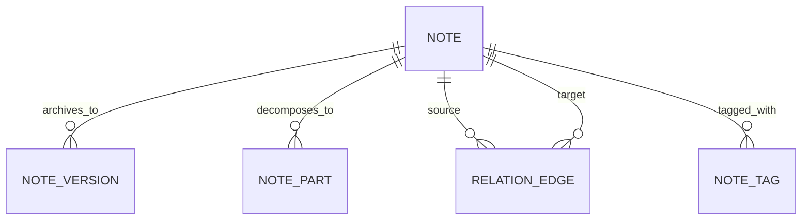

# Keep Logical Model and Dynamic Projections (Historical Baseline)

Date: 2026-03-03
Status: Superseded
Superseded by:
- `later/simplified-model-and-continuation-design.md`
- `later/continuation-api-spec.md`
- `later/continuation-machine-architecture.md`

## Purpose

This note preserves the original, more normalized E-R framing used early in design.

## Historical E-R Snapshot

## Why It Was Superseded

- The model was too split across special entities.
- Projection shape (`anchor/retrieve/expand/rank/shape`) diverged from the later unified frame pipeline.
- Continuation/callback vocabulary was replaced by the clearer `Frame` + `State` and unified `work` contract.

## Canonical Direction

Use these as the active design docs:

1. `simplified-model-and-continuation-design.md` for logical model (`Node + Fact`).
2. `continuation-api-spec.md` for wire contract (`continue(input) -> output`).
3. `continuation-machine-architecture.md` for implementation structure.
